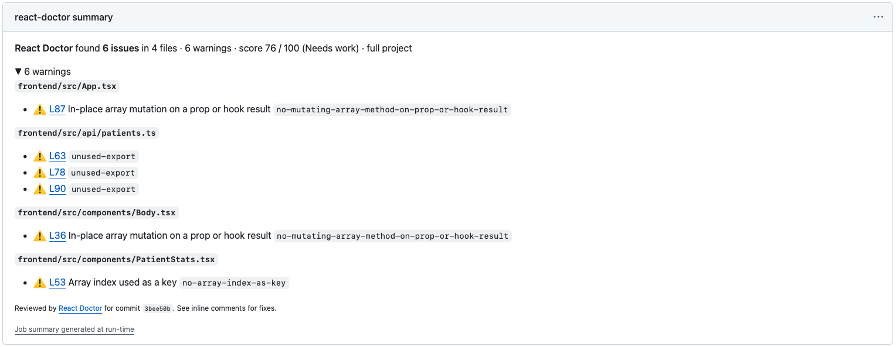
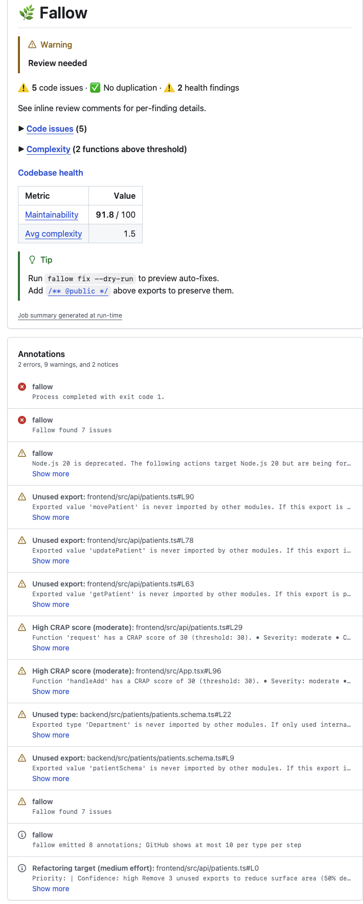
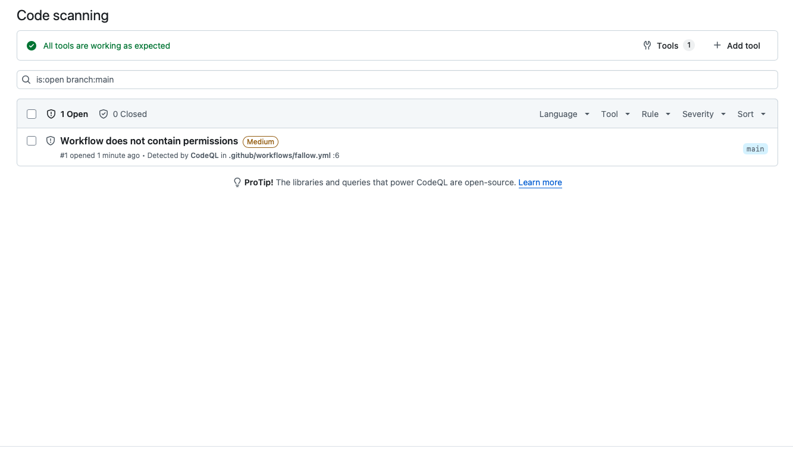
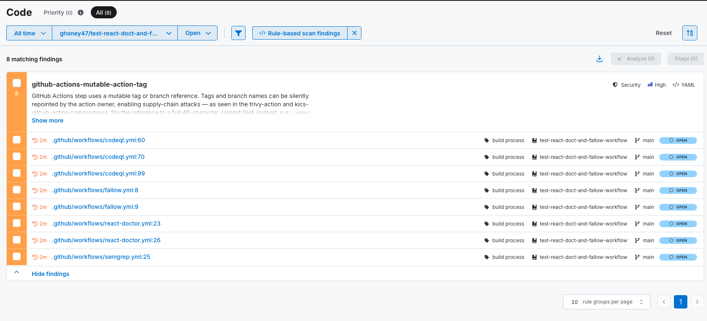

# Testing Results

## React Doctor

We used the default config found in the React Doctor documentation under manual install (for GitHub Actions). Configured to run only on PRs to main by default.

Given the 10 purposely placed bugs, the analysis flagged:

- SA-03
- SA-04
- SA-09

The tool also flagged 3 unused exports in the `api/patients.ts` file.

Seemed to scan positively for errors where the code is making references to non-stable keys, or modifications to props/hooks in-place that do not fire a re-render of the DOM

## Fallow

We used the default configuration of fallow (all checks) found in their documentation for offical GitHub Actions. Configured to run on any PR or push (branch irrelevant) by default. The action will show **failed** when there are issues found. The exit code will be 1, indicating successful scan, errors found.

Given the 10 purposely placed bugs, the analysis flagged none.

The tool instead looked at and found 4 unused exports, a `Node.js` deprecation, and evaluated certain functions as being complex to understand (hard to maintain, high CRAP score).

The tool's strength does not necessary lie in finding the reference bugs, or in the logic, rather looking at the code health as something maintainable, easy to understand, and non-repetitive.

## CodeQL

See `README.md` for the configuration used.

None of the bugs were flagged on this run. Did raise a security point where we did not specify permissions in the fallow workflow.

## Semgrep

Only security findings in the workflow files.

## Takeaways

Because the tools are using pattern matching static analysis, many of the logic errors may be missed; however, the larger and more common mistakes will be noted. From the testing it looks to be React Doctor and Fallow could be great to introduce into a CI/CD pipeline, where CodeQL and Semgrep may need more testing on a larger scale. Nonetheless, all the tools were very straightforward in their installation and use.
